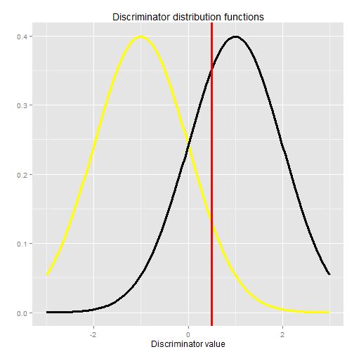

## Concept

1. Use this Shiny app to enhance your understanding of ROC curves.
2. ROC curves provide a way to assess binary classifiers.
3. Binary classifiers use a discriminator to distinguish two groups.
4. For example, blood pressure could be used to distinguish hypertensives and normals.
5. Or, glucose could be used to distinguish diabetics and normals.
6. One must select a discriminator threshold to classify the two groups.
7. Discriminator threshold value determines classifier performance.
8. Classifier performance is assessed by true and false positive rates.
9. Classifier performance is also assessed by the area under curve (AUC).

---

## Concept (continued)

10. This app provides two discriminator normal distributions.
11. The two groups are to be classified based on discriminator value.
12. The group means and standard deviations are slider-adjustable.
13. A ROC curve is created from these distributions.
14. The discriminator threshold value is slider-adjustable.
15. Use the sliders to see how adjustable parameters change the ROC curve.
16. View the curves on the Plots tab.

---

## Here are app distributions with means -1 and 1, standard deviations 1, and threshold 0.5

 

---

## This is the associated app generated ROC curve

 
